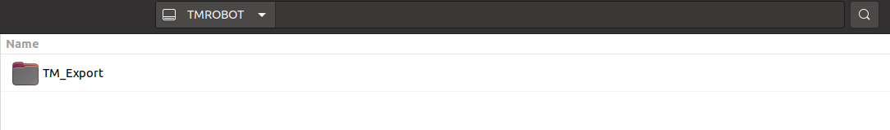
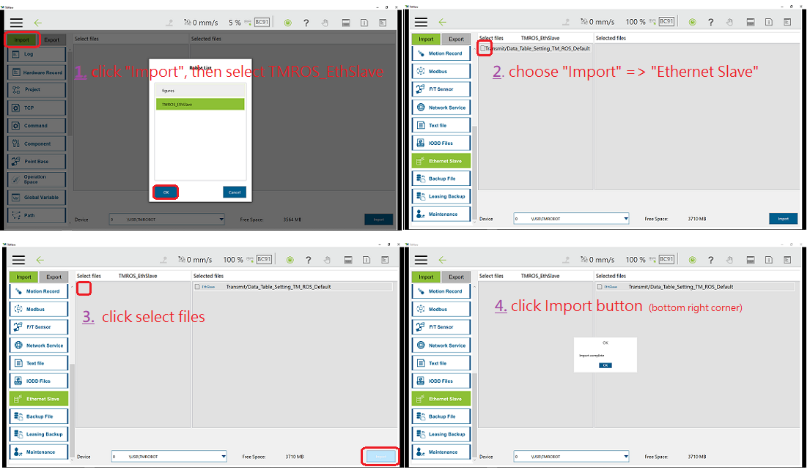
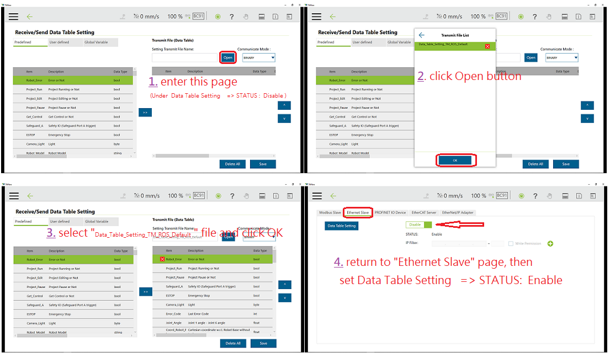

# __TM ROS Driver vs TMflow software Usage__

For TM Plug&Play supported items of TMflow software, users do not need to write additional programs or dig into technical documents of both parties before integrating, but import the software package to use in TMflow directly. Place the downloaded component in the folder named TM_Export in the root directory of a USB drive labeled with TMROBOT. Insert the USB drive into to Control Box and navigate to &rArr;  System &rArr; Import/Export to import the component onto the robot.

## __Import Data Table Setting__
Insert the flash drive into the Techman Robot Control Box before using the function.
To use the Import function: Click on the Import button at the top left, select the robot of the data source in the flash drive from the robot list, and then select the desired data from the Select file box. Click an item in this box to add the item to the Selected Files box. After completing the new addition, click Import at the bottom right to start the Import procedure.

### &sect; Update files from the git repository
>To download and unzip the update files, then place all the content generated from the unzipped files, or directly clone the TM driver of the git repository into the root directory of the USB flash drive labeled with __TMROBOT__ by typing 
``git clone https://github.com/TechmanRobotInc/TM_Export.git`` 
>
> 
### &sect; Insert the USB flash drive into the Control Box

> Mouse-click to enter the page of __System &rArr; Import/Export__ in order.   
> 1. Click Import on the top left, then select to apply the imported setting ``TMROS_EthSlave`` in the Robot List prompted and click OK. 
> 2. Click to select the project ``Ethernet Slave`` to import in the Import Project List prompted. 
> 3. Click to select the specified file``Data_Table_Setting_XXX_ROS_Default`` of the setting listed in Selected Files.
> -  For the __TMflow__ Series, it needs to be used with the __Data_Table_Setting_TM_ROS_Default__ file. 
> -  For the __TMflow 2__ Series (+ __TM S-Series__ ), it needs to be used with the __Data_Table_Setting_TM2_ROS_Default__ file. 
>
> 4. Click Import at the bottom right to import the setting. 
>
> 
### &sect; Transmit the __Ethernet Slave Data Table__ TM ROS default settings
> After importing, mouse-click to enter the page of __Setting &rArr; Connection &rArr; Ethernet Slave__ in order.  
>
> 1. On the ``Ethernet Slave`` setting page, let Data Table Setting STATUS: Disable, then click ``Data Table Setting`` to enter the next page. 
> 2. On the ``Receive/Send Data Table Setting`` setting page, click ``Open`` to select files of the setting listed in Transmit File List prompted. 
> 3. Select the specified file ``Data_Table_Setting_XXX_ROS_Default`` in the Transmit File List prompted and click OK. 
> 4. Return to the ``Ethernet Slave`` setting page, and enable the `Data Table Setting` item to STATUS: Enable. 
>
> 
> You have completed the predefined TM ROS default project to receive/send specific data. 

